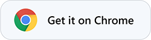
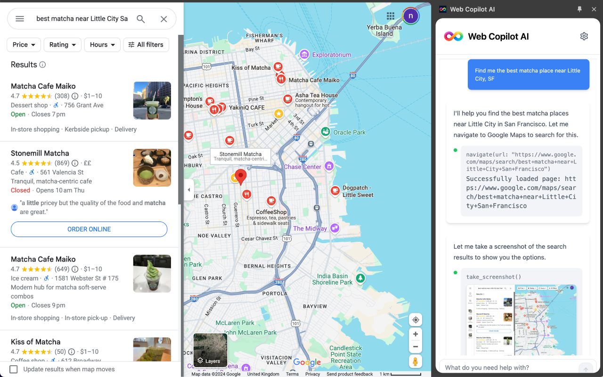
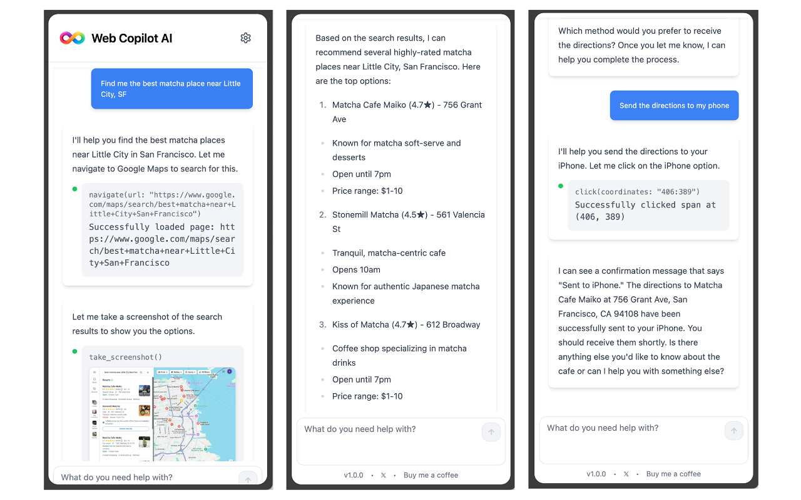

<div align="center">

<h1>Web Copilot AI</h1>

</div>

An AI-powered Chrome side panel assistant that understands natural language and performs real actions in your browser.

<br>
<div align="center">
  <a href="https://chromewebstore.google.com/detail/web-copilot-ai/moimddgmepjjlbchcbpcinlpljnnennp">
    
  </a>
</div>
<br>

### What it does
- **Automates the web**: clicks, navigates, opens tabs, and interacts with pages
- **Understands pages**: takes and analyzes screenshots for context
- **Conversational UI**: chat to get tasks done, with actionable option prompts


### Preview



### Shortcut
Press **`⌘ + .`** or **`Ctrl + .`** to open the side panel.

### Example use cases
> "Book me the cheapest flight to Tokyo for next week."

> "Solve this test for me."

> "Complete this DuoLingo level."

> "I'm hungry, order me something healthy."

<br>
<h1></h1>
### Manual installation
1. **Prereqs**: Bun v1+, Chrome.
2. **Install**:
```bash
bun install
```
3. **Develop (watch + rebuild)**:
```bash
bun run dev
```
Then in Chrome: `chrome://extensions` → enable Developer mode → Load unpacked → select the `dist/` folder.
4. **Production build (creates zip)**:
```bash
bun run build
```
This outputs `dist/` and `chrome_extension.zip`.

### Configure
- Click the extension icon to open the side panel.
- Open Settings (gear) → paste your Anthropic API key (Claude).
- The key is stored locally via `chrome.storage.local` and used directly in the browser.

### How it works
- **MV3**: a service worker exposes `/api/chat` and streams responses via Vercel AI SDK to Anthropic Claude.
- **Tools**: screenshot, click by coordinates, open tabs, navigate, and interact with elements.
- **UI**: React + Tailwind in the side panel (`ChatInterface`). A content script runs at `document_start` for page access.


### Permissions
- `sidePanel`, `storage`, and `host_permissions: <all_urls>` to automate across sites.

### Tech stack
- Chrome Extensions MV3, React 18, Tailwind, Vercel AI SDK, Anthropic, Bun.
